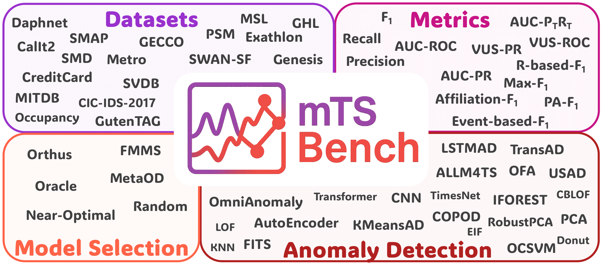

<p align="center">
  
</p>

<h1 align="center">
  
  <b>mTSBench: Benchmarking Multivariate Time Series Anomaly Detection and Model Selection at Scale</b>
</h1>


<!-- <p align="center">
  <a href="https://huggingface.co/datasets/PLAN-Lab/mTSBench">
    
  </a>
</p> -->

---


Anomaly detection in multivariate time series is essential across domains such as healthcare, cybersecurity, and industrial monitoring, yet remains fundamentally challenging due to high-dimensional dependencies, the presence of cross-correlations between time-dependent variables, and the scarcity of labeled anomalies. We introduce **mTSBench**, the largest benchmark to date for multivariate time series anomaly detection, consisting of 344 labeled time series from a wide range of domains. We comprehensively evaluate 24 anomaly detectors, including the only two publicly available large language model-based methods for multivariate time series. Consistent with prior findings, we observe that no single detector dominates across datasets, motivating the need for effective model selection. We benchmark three recent detector selection methods and find that even the strongest of them remain far from optimal.


## Table of Contents

- [📄 Overview](#overview)
- [⚙️ Get Started](#start)
    * [💻 Installation](#mts)   
    * [🗄️ Dataset](#dataset)
    * [🔍 Anomaly Detectors](#detector)  
    * [🎯 Model Selection](#select)

<h2 id="overview"> 📄 Overview </h2>

 We introduce **mTSBench** the largest benchmark to date for multivariate time
series anomaly detection. It includes

* 344 labeled time series across 12 domains 
* 24 anomaly detectors, including the only two publicly available large language model-based methods for multivariate time series
* 3 model selection methods 
* 13 anomaly detection evaluation metrics and 3 model selection metrics


<h2 id="start"> ⚙️ Get Started </h2>

<h3 id="mts">💻 Installation</h3>


**Step 1:** Create and activate a `conda` environment named `mTSB`.

```bash
conda create -n mTSB python=3.11   
conda activate mTSB
```

**Step 2:** Install the dependencies from requirements.txt:
```bash
pip install -r requirements.txt
```

<h3 id="dataset">🗄️ Dataset</h3>

Due to the size of the full dataset, we only include a few example time series in this repo (see folder `Dataset`). The full dataset will be provided upon acceptance of the paper.


<h3 id="detector">🔍 Anomaly Detectors</h3>

<!-- Detectors in **mTSBench** follows the implementation mechanism of [https://github.com/TheDatumOrg/TSB-AD](TSB-AD). Any new addtional detector can be easily add to **mTSBench**.  -->

To run evaluation with an detector, follow the example below. 

```python
import pandas as pd
import time
import os
import sys
from Detectors.model_wrapper import run_Unsupervise_AD, run_Semisupervise_AD
from Detectors.evaluation.metrics import get_metrics
from filelock import FileLock
from datasets import load_dataset

# Load the CalIt2 dataset
df = pd.read_csv("Datasets/mTSBench/CalIt2/CalIt2_traffic_test.csv")

# using KMeansAD
detector = 'KMeansAD'

data = df.iloc[:, 1:-1].values.astype(float) # excluede first (time stamp) and last (label) columns 
label = df['is_anomaly'].astype(int).to_numpy()

start = time.time()
output = run_Unsupervise_AD(detector, data) # change this to run_Semisupervise_AD if the detector is semi-supervised
end = time.time()
runtime = end - start

metrics = get_metrics(output, label)
record = {
    "data_file": data_name, 
    "model": detector,
    "runtime": runtime,
    **metrics
}

# Save results to results/<detector>_evaluation_results.csv
results_dir = "results"
os.makedirs(results_dir, exist_ok=True)

log_file = os.path.join(results_dir, f"{detector}_evaluation_results.csv")
with FileLock(log_file + ".lock"):
    df_log = pd.DataFrame([record])
    write_header = not os.path.exists(log_file)
    df_log.to_csv(log_file, mode='a', header=write_header, index=False)
```


<h3 id="select">🎯 Model Selection</h3>

**mTSBench** includes three selection methods: [MetaOD](https://github.com/yzhao062/MetaOD), [FMMS](https://github.com/bettyzry/FMMS), and [Orthus](https://openreview.net/forum?id=7cUV9K3ns9Q). While these are unsupervised selection methods, the training requires a performance matrix. Therefore, we hold out a validation time series from each of the 19 datasets.


#### Run model selection with MetaOD

Set up the environment with 

You can use the follow code to test out pretrained MetaOD on any time series with the following code. You can replace `CalIts` with other name listed in `data_summary.csv` under `Datasets` folder.

```bash
cd Selectors/MetaOD
python metaod_example.py CalIt2
```

Check the instructions under `MetaOD` folder for running the entire experiments on all 344 time series.


#### Run model selection with FMMS

Set up the environment with 

You can use the follow code to test out pretrained FMMS on any time series with the following code. You can replace `CalIts` with other name listed in `data_summary.csv` under `Datasets` folder.

```bash
cd Selectors/FMMS
python FMMS_example.py CalIt2
```


#### Run model selection with Orthus

The original implementation of Orthus is in R. While we do plan to provide a Python version, you have to download R and R studio to use Orthus for the moment. 


1. Set up the environment with `main.R` under `Selectors/Orthus`. It is install all required libraries
2. Get metafeature on training set with `get_train_meta_features.R`
3. Get recommendation with `get_rec_on_test.R`


<h2 align="center">
  
  <b>mTSBench: Benchmarking Multivariate Time Series Anomaly Detection and Model Selection at Scale</b>
</h2>


### Overview of Multivariate Time-Series Datasets, details in `data_summary.csv`

| **Dataset**     | **Domain**                 | **#TS** | **#Dims** | **Length** | **#AnomPts** | **#AnomSeqs** |
|-----------------|----------------------------|--------:|----------:|------------|--------------:|--------------:|
| CalIt2          | Smart Building             |      1  |        3  | >5K         |             0 |            21 |
| CreditCard      | Finance / Fraud Detection  |      1  |       30  | >100K       |           219 |            10 |
| Daphnet         | Healthcare                 |     26  |       10  | >50K        |             0 |         1–16  |
| Exathlon        | Cloud Computing            |     30  |       21  | >50K        |          0–4  |         0–6   |
| GECCO           | Water Quality Monitoring   |      1  |       10  | >50K        |             0 |            37 |
| GHL             | Industrial Process         |     14  |       17  | >100K       |             0 |         1–4   |
| Genesis         | Industrial Automation      |      1  |       19  | >5K         |             0 |             2 |
| GutenTAG        | Synthetic Benchmark        |     30  |       21  | >10K        |             0 |         1–3   |
| MITDB           | Healthcare                 |     47  |        3  | >500K       |             0 |      1–720    |
| MSL             | Spacecraft Telemetry       |     26  |       56  | >5K         |             0 |         1–3   |
| OPPORTUNITY     | Human Activity Recognition |     13  |       33  | >25K        |             0 |             1 |
| Occupancy       | Smart Building             |      2  |        6  | >5K         |          1–3  |        9–13   |
| PSM             | IT Infrastructure          |      1  |       27  | >50K        |             0 |            39 |
| SMAP            | Spacecraft Telemetry       |     48  |       26  | >5K         |             0 |         1–3   |
| SMD             | IT Infrastructure          |     18  |       39  | >10K        |             0 |        4–24   |
| SVDB            | Healthcare                 |     78  |        3  | >100K       |             0 |      2–678    |
| CIC-IDS-2017    | Cybersecurity              |      5  |       73  | >100K       |      0–8656   |    0–2546     |
| Metro           | Transportation             |      1  |        6  | >10K        |            20 |             5 |
| SWAN-SF         | Industrial Process         |      1  |       39  | >50K        |          5233 |          1382 |


### Detectors

| **Learning**     | **Anomaly Detection Method** | **Area**             | **Method Family**       |
|------------------|------------------------------|----------------------|--------------------------|
| **Unsupervised** | CBLOF                        | Outlier Detection    | **Distance**             |
|                  | COPOD                        | Outlier Detection    | **Distribution**         |
|                  | EIF                          | Classic ML           | **Tree**                 |
|                  | HBOS                         | Classic ML           | **Distribution**         |
|                  | IForest                      | Outlier Detection    | **Tree**                 |
|                  | KMeansAD                     | Classic ML           | **Distance**             |
|                  | KNN                          | Classic ML           | **Distance**             |
|                  | LOF                          | Outlier Detection    | **Distance**             |
|                  | PCA                          | Classic ML           | **Reconstruction**       |
|                  | RobustPCA                    | Classic ML           | **Reconstruction**       |
| **Semi-supervised** | AnomalyTransformer        | Deep Learning        | **Forecasting**          |
|                  | AutoEncoder                  | Deep Learning        | **Reconstruction**       |
|                  | CNN                          | Deep Learning        | **Reconstruction**       |
|                  | Donut                        | Deep Learning        | **Reconstruction**       |
|                  | FITS                         | Deep Learning        | **Forecasting**          |
|                  | LSTMAD                       | Deep Learning        | **Forecasting**          |
|                  | MCD                          | Classic ML           | **Reconstruction**       |
|                  | OCSVM                        | Outlier Detection    | **Distribution**         |
|                  | OmniAnomaly                  | Deep Learning        | **Reconstruction**       |
|                  | TimesNet                     | Deep Learning        | **Forecasting**          |
|                  | TranAD                       | Deep Learning        | **Forecasting**          |
|                  | USAD                         | Deep Learning        | **Reconstruction**       |
|                  | ALLM4TS                      | LLM                  | **Foundation Model**     |
|                  | OFA                          | LLM                  | **Foundation Model**     |


### 🎉 Acknowledgement
We appreciate the following github repos a lot for their valuable code base:
* https://github.com/TheDatumOrg/TSB-AD
* https://github.com/yzhao062/MetaOD
* https://github.com/bettyzry/FMMS
* https://openreview.net/forum?id=7cUV9K3ns9Q
* https://github.com/yxbian23/aLLM4TS
* https://github.com/yzhao062/pyod
* https://github.com/TimeEval/TimeEval-algorithms
* https://github.com/thuml/Time-Series-Library/
* https://github.com/dawnvince/EasyTSAD


